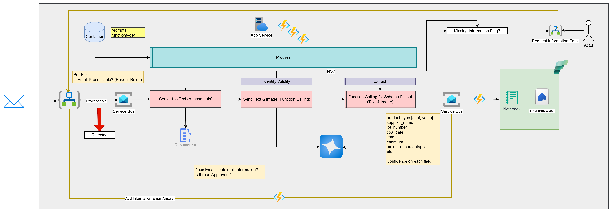

# CQC Email Processor

Enterprise-grade Azure email processing service that:
- Prefilters inbound emails with Logic App rules.
- Processes eligible messages through Service Bus and Azure Functions.
- Converts attachments to text, validates, and extracts COA fields with confidence.
- Enqueues Fabric write commands to a dedicated Service Bus writer queue.
- Persists records to Fabric Silver via a single writer function + notebook/job execution.
- Sends missing-information requests and applies reply-based updates without rerunning AI.

## Architecture

[](docs/architecture.png)
Mermaid source for draw.io MCP workflows: `docs/email-trigger-architecture.mmd`.

## Step-by-step Flow

1. An inbound email arrives and Logic App applies prefilter/header rules.
2. If processable, Logic App sends a message to Service Bus processing queue.
3. `ProcessEmailMessage` function consumes the message, converts attachments to text, and runs validity + extraction.
4. The function builds a Fabric write command and pushes it to the dedicated Fabric writer queue.
5. `ProcessFabricWriteCommand` runs the configured Fabric notebook job to persist/update Silver records.
6. If data is incomplete, the missing-info branch sends a request email and later applies reply updates without rerunning extraction.

## Design Principles

- **Config-first runtime**: endpoints, queues, Fabric targets, and model profiles are supplied via app settings/deploy config, not hardcoded in handlers.
- **Separation of concerns**: triggers remain thin, handlers orchestrate, and adapters encapsulate external services (OpenAI, DocIntel, Service Bus, Logic Apps, Fabric).
- **Idempotent deployment**: infra/function steps are split and repeatable; scripts re-apply state safely.
- **Cloud-managed prompts**: prompts are sourced from blob storage and seeded during function deployment.
- **Fail-fast safety**: required runtime settings are validated early to avoid silent operational failures.
- **Flex + identity triggers**: Service Bus triggers use Python v2 decorators with identity-based app settings (`SERVICEBUS_CONNECTION__fullyQualifiedNamespace`) on Flex Consumption.

## Repository Layout

```text
deploy/              # CLI-based infra/function/fabric deployment scripts
src/                 # Azure Function app and modules
tests/               # Unit, contract, and integration tests
docs/                # Design + deployment + runbook docs
```

## Runtime

- Python 3.11+
- Azure Functions v4 (Python v2 programming model)
- Managed identity authentication through `DefaultAzureCredential`

## Quick Start (Local)

1. Create and activate a virtual environment.
2. Install dependencies:
   - `pip install -e .[dev]`
3. Copy local settings template:
   - `cp local.settings.json.example local.settings.json`
4. Set required environment values.
5. Run:
   - `func start`

## Deployment

Use the config-driven deployment flow in `deploy/`:

- `deploy/deploy.config.toml` - single source of deployment/runtime configuration
- `deploy/deploy-infra.ps1` - deploy Azure infra + Flex Function + RBAC + Fabric bootstrap + app settings
- `deploy/deploy-function.ps1` - publish Function code, seed prompt blobs, and sync triggers
- `deploy/deploy-fabric.ps1` - reusable Fabric bootstrap script (folders, notebooks, lakehouse/table)

Run:

```powershell
# 1. Deploy Azure infra, RBAC, Fabric, and app settings
powershell -ExecutionPolicy Bypass -File "deploy/deploy-infra.ps1" -ConfigPath "deploy/deploy.config.toml"

# 2. Create Exchange Online mailboxes and grant permissions
powershell -ExecutionPolicy Bypass -File "deploy/deploy-exchange.ps1" -ConfigPath "deploy/deploy.config.toml" -AdminUpn "admin@yourdomain.com"

# 3. Publish Function code and seed prompts
powershell -ExecutionPolicy Bypass -File "deploy/deploy-function.ps1" -ConfigPath "deploy/deploy.config.toml"
```

### Manual step after deployment

The Logic App Office 365 Outlook connectors require a **one-time OAuth sign-in**
that cannot be automated. After running all deploy scripts and waiting up to 2
hours for Exchange permission replication:

1. Open each Logic App in the **Azure Portal** (Prefilter, Missing Info,
   Rejection, Reply Monitor)
2. Go to **Logic App Designer**
3. Click the Office 365 Outlook connector and select **Change connection**
4. Sign in with the service account (`svc-cqc-logicapp@yourdomain.com`)
5. Save the Logic App

After this one-time step the pipeline runs fully programmatically.

Detailed deployment notes are in `deploy/README.md`.
